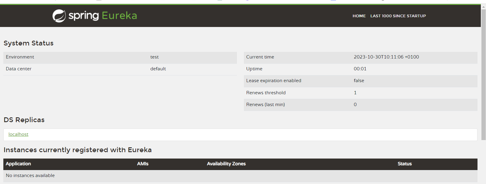

# hamid-bouargalne-enset-adria-test

## 1. Creation des  micro-services :  
tout d'abord on cree un empty projet puis on cree les services pour les ajoutees a ce empty projet par la suite sous formes des modules  
dans ce projet je choisi de travailler avec Eureka

* wallet service :  
on cree le service wallet service avec les dependances suivantes :

```bash
    <dependencies>
        <dependency>
            <groupId>org.springframework.boot</groupId>
            <artifactId>spring-boot-starter-data-jpa</artifactId>
        </dependency>
        <dependency>
            <groupId>org.springframework.boot</groupId>
            <artifactId>spring-boot-starter-data-rest</artifactId>
        </dependency>
        <dependency>
            <groupId>org.springframework.boot</groupId>
            <artifactId>spring-boot-starter-web</artifactId>
        </dependency>
        <dependency>
            <groupId>org.springframework.cloud</groupId>
            <artifactId>spring-cloud-starter-netflix-eureka-client</artifactId>
        </dependency>

        <dependency>
            <groupId>com.h2database</groupId>
            <artifactId>h2</artifactId>
            <scope>runtime</scope>
        </dependency>
        <dependency>
            <groupId>org.projectlombok</groupId>
            <artifactId>lombok</artifactId>
            <optional>true</optional>
        </dependency>
</dependencies>
```
* transfer-service :    
on cree le transfer-service avec les memes dependances que wallet service
* gateway-service :    
 on cree le gateway-service avec les dependances suivantes :  

```bash
 <dependencies>
        <dependency>
            <groupId>org.springframework.boot</groupId>
            <artifactId>spring-boot-starter-actuator</artifactId>
        </dependency>
        <dependency>
            <groupId>org.springframework.cloud</groupId>
            <artifactId>spring-cloud-starter-gateway</artifactId>
        </dependency>
        <dependency>
            <groupId>org.springframework.cloud</groupId>
            <artifactId>spring-cloud-starter-netflix-eureka-client</artifactId>
        </dependency>
     </dependencies>
```
* discovery-service :    
on cree le discovery-service avec les dependances suivantes :


```bash
    <dependencies>
		<dependency>
			<groupId>org.springframework.cloud</groupId>
			<artifactId>spring-cloud-starter-netflix-eureka-server</artifactId>
		</dependency>
     </dependencies>
```
* config-service :    
on cree le config-service avec les dependances suivantes :  
```bash
    <dependencies>
		<dependency>
			<groupId>org.springframework.boot</groupId>
			<artifactId>spring-boot-starter-actuator</artifactId>
		</dependency>
		<dependency>
			<groupId>org.springframework.cloud</groupId>
			<artifactId>spring-cloud-starter-config</artifactId>
		</dependency>
     </dependencies>
```

## 1. Developpemnet des  micro-services :  
* gateway-service :
  dans le fichier application.properties
  ```bash
  server.port=8083
  spring.application.name=gateway-service
  spring.cloud.discovery.enabled=true
  ```
  et dans le fichier on definit les routes d'une maniere dynamic
  ```
      @Bean
    DiscoveryClientRouteDefinitionLocator dynamicRoutes(
            ReactiveDiscoveryClient rdc,
            DiscoveryLocatorProperties dlp) {

        return new DiscoveryClientRouteDefinitionLocator(rdc, dlp);


    }
  ```
* discovery-service :
  de mmeme dans le fichier de configuration de l'application on definit les parametres de l'app :
```
server.port=8761
eureka.client.fetch-registry=false
eureka.client.register-with-eureka=false
```
  

* Wallet-service :
  application.properties
```
server.port=8081
spring.application.name=wallet-service
spring.datasource.url=jdbc:h2:mem:db_wallet
spring.cloud.discovery.enabled=true
```
apres cela je cree les deux entities Client et Wallet et je initialise quelques attribus de Client 

